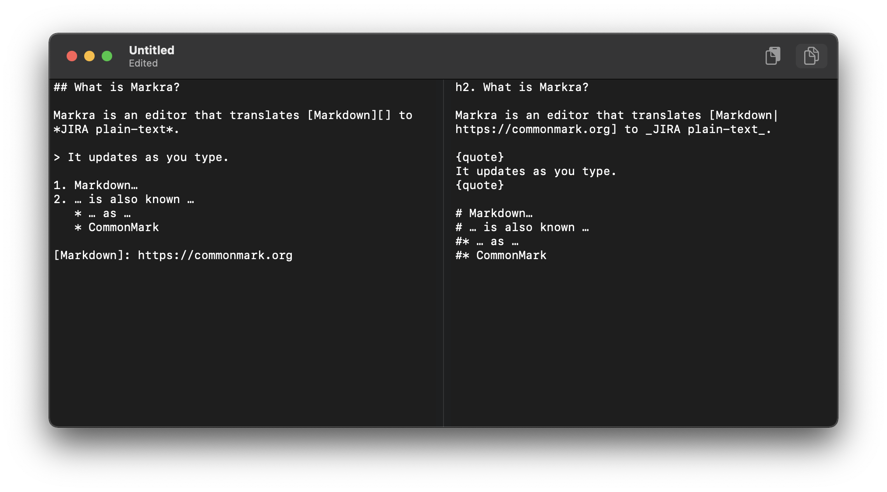

Markra is a Markdown-to-JIRA plaintext editor for macOS.

It is written in SwiftUI and Composable Architecture.

Markra is released under the MIT licence. See [LICENSE.md][].

[LICENSE.md]: LICENSE.md
